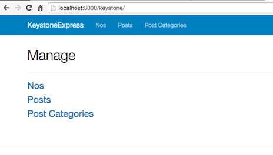

# Keystone-Express
:rocket::sparkles: Showing how to keystone works with express :sparkles:

:key: https://github.com/keystonejs/keystone :key:

This is an Express application showing how Keystonejs & express work together.

- localhost:3000 === hello world
- localhost:3000/keystone ===  keystone admin panel

:warning::construction:
Still in progress  :construction::warning:

Talked with creator & lead keystone.js developer an we gonna try to make this part of the official :key:Keystone demo project:key:

>Additional Resource Below

How to Add Keystone to an Already Existing Express App.
:arrow_right:https://github.com/keystonejs/keystone/wiki/How-to-Add-Keystone-to-an-Already-Existing-Express-App
